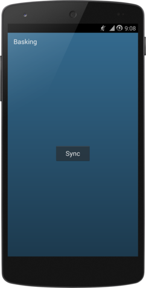

# basking

Android app built on top of the [basking](https://github.com/danhawkes/basking) and [thresher](https://github.com/danhawkes/thresher) Grooveshark libraries.

    

## Features / todo

- [x] Sync library to a specified folder  
    - [x] Periodically sync in background (keep library up to date)  
- [x] Generate playlists for use by other music apps  
- [ ] Prettier info about sync process in the app: Mirror info in notification on sync screen - X songs, Y favorites, etc.  
- [ ] Display contents of library in-app 
- [ ] UI to search for songs, and add to library  
    - [ ] 'Preview' songs - listen to a search result without adding to library
  